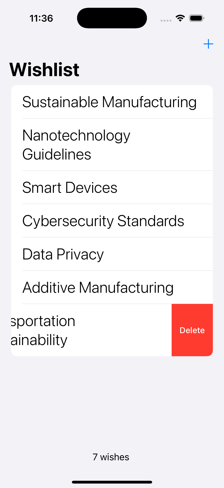

# 🎯 SwiftUI Wishlist App

A modern iOS wishlist application built with SwiftUI and SwiftData, allowing users to create, manage, and persist their wishes with an elegant and intuitive interface.



## 📋 Table of Contents

- [Features](#features)
- [Requirements](#requirements)
- [Installation](#installation)
- [Project Structure](#project-structure)
- [Architecture](#architecture)
- [Key Technologies](#key-technologies)
- [Usage](#usage)
- [Code Highlights](#code-highlights)
- [Learning Resources](#learning-resources)
- [Contributing](#contributing)
- [License](#license)
- [Author](#author)

## ✨ Features

- **Create Wishes**: Add new wishes through an intuitive alert dialog
- **Persistent Storage**: Automatic data persistence using SwiftData framework
- **Delete Wishes**: Remove wishes with swipe-to-delete gesture
- **Wish Counter**: Real-time display of total wishes count
- **Empty State**: Beautiful empty state UI when no wishes exist
- **Clean Interface**: Modern iOS design with navigation stack and toolbar
- **Data Validation**: Input validation to prevent empty wishes

## 📱 Requirements

- iOS 17.0+
- Xcode 15.0+
- Swift 5.9+
- macOS 14.0+ (for development)

## 🚀 Installation

1. **Clone the repository**
   ```bash
   git clone https://github.com/alassanepaulyaro/SwiftUIProject4-Wishlist.git
   cd SwiftUIProject4-Wishlist
   ```

2. **Open in Xcode**
   ```bash
   open SwiftUIProject4-Wishlist.xcodeproj
   ```

3. **Build and Run**
   - Select your target device or simulator
   - Press `Cmd + R` to build and run the app

## 📁 Project Structure

```
SwiftUIProject4-Wishlist/
├── SwiftUIProject4-Wishlist/
│   ├── SwiftUIProject4_WishlistApp.swift  # App entry point
│   ├── ContentView.swift                   # Main UI view
│   └── WishModel.swift                     # Data model
├── SwiftUIProject4-Wishlist.xcodeproj/
├── Screenshot1.png                         # App screenshot
└── README.md                               # Documentation
```

## 🏗️ Architecture

### Data Model

The app uses a simple yet effective data model with SwiftData:

```swift
@Model
class Wish {
    var title: String

    init(title: String) {
        self.title = title
    }
}
```

**Key Points:**
- Uses `@Model` macro for SwiftData integration
- Automatic persistence without manual Core Data setup
- Simple single-property model focused on wish titles

### View Structure

The app follows SwiftUI best practices:

- **NavigationStack**: Provides navigation context and toolbar support
- **List**: Displays wishes in a scrollable list
- **Alert**: Modal dialog for creating new wishes
- **ContentUnavailableView**: Elegant empty state when no data exists
- **Toolbar**: Contains add button and wish counter

## 🔑 Key Technologies

### SwiftUI
- Modern declarative UI framework
- State management with `@State` and `@Environment`
- Native iOS components and gestures

### SwiftData
- Apple's newest data persistence framework (iOS 17+)
- Replaces Core Data with simpler API
- `@Model` macro for automatic persistence
- `@Query` for reactive data fetching
- `ModelContext` for CRUD operations

## 💡 Usage

### Adding a Wish
1. Tap the **+** button in the top-right corner
2. Enter your wish in the text field
3. Tap **Save**

### Deleting a Wish
1. Swipe left on any wish
2. Tap the **Delete** button

### Viewing Wish Count
- The total number of wishes appears in the bottom toolbar
- Counter shows "1 wish" or "X wishes" (grammatically correct)

## 🎓 Code Highlights

### SwiftData Integration

```swift
@Environment(\.modelContext) private var modelContext
@Query private var wishes: [Wish]
```

- `modelContext`: Manages database operations
- `@Query`: Automatically fetches and observes data changes

### Creating Data

```swift
modelContext.insert(Wish(title: title))
```

### Deleting Data

```swift
modelContext.delete(wish)
```

### Swipe Actions

```swift
.swipeActions {
    Button("Delete", role: .destructive) {
        modelContext.delete(wish)
    }
}
```

### Empty State

```swift
.overlay {
    if wishes.isEmpty {
        ContentUnavailableView(
            "My wishlist",
            systemImage: "heart.circle",
            description: Text("No wishes yet. Add one to get started.")
        )
    }
}
```

### Input Validation

```swift
Button {
    if title.isEmpty {
        return
    } else {
        modelContext.insert(Wish(title: title))
        title = ""
    }
} label: {
    Text("Save")
}
```

## 📚 Learning Resources

This project demonstrates several important iOS development concepts:

1. **SwiftData Basics**: Modern data persistence
2. **CRUD Operations**: Create, Read, Update, Delete
3. **State Management**: `@State`, `@Environment`, `@Query`
4. **UI Components**: NavigationStack, List, Alert, Toolbar
5. **Gestures**: Swipe actions
6. **Empty States**: ContentUnavailableView
7. **Previews**: Multiple preview configurations for testing

### Concepts Covered

- ✅ **Data Model**: SwiftData `@Model` macro
- ✅ **Persistent Storage**: Automatic data persistence
- ✅ **List Management**: Dynamic list with ForEach
- ✅ **User Input**: Alert-based text input
- ✅ **Delete Functionality**: Swipe-to-delete pattern
- ✅ **Conditional UI**: Empty state handling
- ✅ **Toolbar Customization**: Multiple toolbar items
- ✅ **Preview Variants**: Testing with sample data and empty state

## 🤝 Contributing

Contributions are welcome! Here are some ways you can contribute:

1. **Report Bugs**: Open an issue describing the bug
2. **Suggest Features**: Share your ideas for new features
3. **Submit Pull Requests**: Fix bugs or add features

### Development Workflow

1. Fork the repository
2. Create a feature branch (`git checkout -b feature/AmazingFeature`)
3. Commit your changes (`git commit -m 'Add some AmazingFeature'`)
4. Push to the branch (`git push origin feature/AmazingFeature`)
5. Open a Pull Request

## 📄 License

This project is available for educational and personal use. Feel free to use it as a learning resource or template for your own projects.

## 👤 Author

**Yaro Paul (Alassane Paul Yaro)**

- GitHub: [@alassanepaulyaro](https://github.com/alassanepaulyaro)
- Project Link: [SwiftUIProject4-Wishlist](https://github.com/alassanepaulyaro/SwiftUIProject4-Wishlist)

---

## 🎯 Future Enhancements

Potential features for future development:

- [ ] Edit existing wishes
- [ ] Categories or tags for wishes
- [ ] Priority levels
- [ ] Due dates or reminders
- [ ] Search functionality
- [ ] Share wishes
- [ ] Dark mode optimization
- [ ] Wish completion status
- [ ] Export/Import wishlist
- [ ] Cloud sync with iCloud

## 🐛 Known Issues

No known issues at this time. Please report any bugs in the Issues section.

---

**Created**: December 3, 2024
**Last Updated**: November 14, 2025

*Built with ❤️ using SwiftUI and SwiftData*
